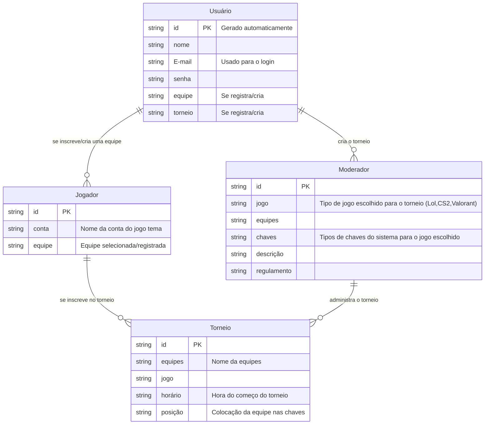

# 🛠️ Especificação Técnica (Tech Spec) - ArenaRank

Este documento detalha arquitetura técnica, o modelo de dados e os contratos de API (via JSON Server) necessárias para o funcionamento da plataforma de torneios e-sports amadores ArenaRank.

## 1. Modelo de Dados (Diagrama ER)

Abaixo está o Diagrama Entidade-Relacionamento (DER) que representa a estrutura do nosso "banco de dados" (`db.json`) e como as informações se conectam.

## 2. Dicionário de Dados

Breve explicação das tabelas principais:

- **Usuário:** Responsável pelo registro de equipes, pela criação ou participação de torneios.
  - Id: Identificador único gerado pelo JSON Server (String ou Hash).
  - E-mail: Usado para login e recebimento de notificações do sistema.
  - Equipe: Equipe registrada/criada pelo usuário que permite a incrição/participação de torneios.
  - Torneio: Campeonato criado pelo moderador.
- **Moderador:**
  - Jogo: O moderador irá escolher o jogo tema do cameponato.
  - Chaves: O moderador irá ordenar as chaves baseado nas equipes registradas e no formato das regras criadas pelo mesmo.
- **Jogador:**
  - Conta: Nome dá conta do jogo selecionado para o torneio.
  - Equipe: Nome da equipe registrada ou selecionada caso o jogador seje o líder.
- **Torneio:**
  - Equipes: Nomes das equipes registradas
  - Horário: Impressão de data e horário do começo do torneio.
  - Posição: Colocamento das equipes dentro da chave.

## 3. Técnologias
- **Framework:** bootstrap v5.3.8
- **API:** Challengermode (GraphQL)
